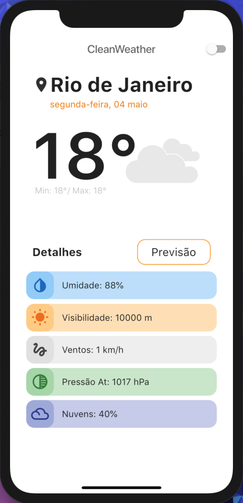
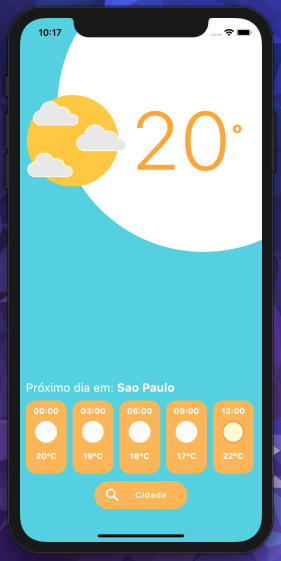

# weather_flutter

Aplicativo com o inuito de mostrar a previsão climática atual e do dia seguinte para o usuário.

 

 
 

 # O App aborda:

    • Consumo de api(openweathermap).
  
    • Mudança de Cores de acordo com o horário(dia e noite) .
    
    • Mostra o clima de acordo com a cidade escolhida.
  
    
