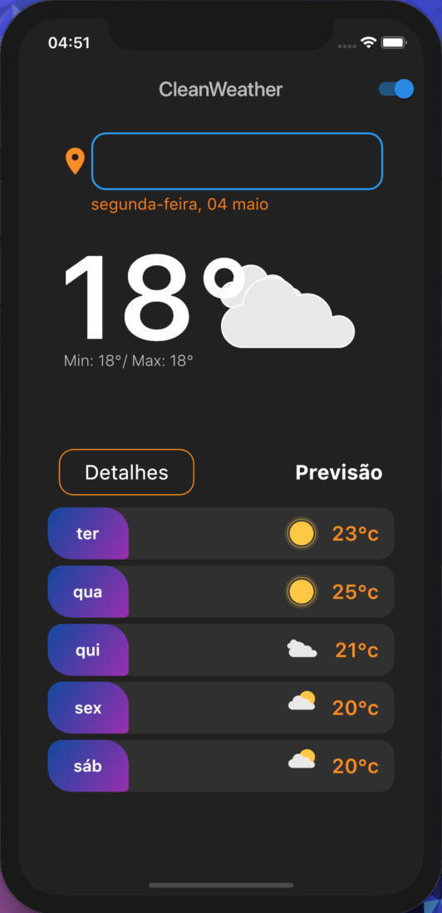

# weather_flutter

Aplicativo com o inuito de mostrar a previsão climática atual e do dia seguinte para o usuário.

 

 
 

 # O App aborda:

    • Consumo de api(openweathermap).
  
    • Mudança de Cores de acordo com o horário(dia e noite) .
    
    • Mostra o clima de acordo com a cidade escolhida.
  
    
  

## Getting Started

This project is a starting point for a Flutter application.

A few resources to get you started if this is your first Flutter project:

- [Lab: Write your first Flutter app](https://flutter.dev/docs/get-started/codelab)
- [Cookbook: Useful Flutter samples](https://flutter.dev/docs/cookbook)

For help getting started with Flutter, view our
[online documentation](https://flutter.dev/docs), which offers tutorials,
samples, guidance on mobile development, and a full API reference.
